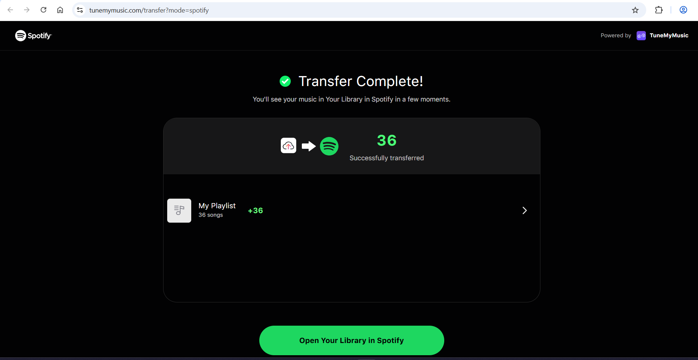

# Gaana.com → Spotify Playlist Exporter

This project helps you transfer your **Gaana.com** playlist to **Spotify**.

Provide a Gaana.com playlist URL and the tool will generate a `songs.txt` file containing the **song names** and their **respective artists**.  
Upload/import this `.txt` file into Spotify, and your playlist is transferred.

## Usage

1. Open [internal/apis/apis.go](internal/apis/apis.go) and set the `api` variable to your Gaana.com playlist URL (the tool will not prompt for it).
   ```go
   var api string = "https://gaana.com/playlist/your-playlist-url"
   ```
2. Run the tool: `go run main.go`.
3. Find the generated `songs.txt` file.
4. Upload/import `songs.txt` into Spotify to recreate the playlist.

## Output

- `songs.txt` — list of tracks with artist names (one entry per line).

## Proof

